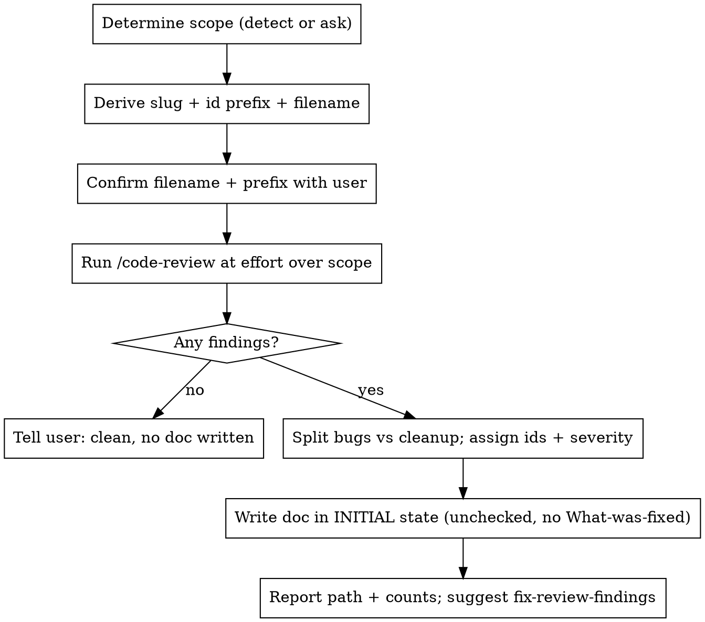

# Code Review Doc

## Overview

Run `/code-review` over a branch or working-tree diff and persist its findings as a `docs/review/<slug>-DDMM.md` handoff document in the stable-id format that `fix-review-findings` consumes.

**Core principle:** this skill is **produce-only** and writes the document in its **initial, unfixed state** — unchecked checklist boxes and **no "What was fixed" notes**. Those are written later by `fix-review-findings` as it works the doc. The empty-template-here / filled-template-there seam is what lets the two skills compose; emitting anything that claims a fix is already done corrupts that contract.

This skill does **not** edit code, run the verify gate, or touch git history. It reviews and writes one markdown file.

## When to Use

- The user wants a branch or diff reviewed into a durable findings doc before a fix pass or PR.
- "Write up a code review of this branch", "produce a review handoff doc", "review the diff into `docs/review/`".

**Not for:** applying fixes from an existing findings doc (use `fix-review-findings`); a full whole-codebase baseline audit filed as GitHub issues (use `codebase-audit`); reviewing a diff with no persisted output (just use `code-review` / `/code-review` directly).

## Inputs

- **Effort** (optional): the `/code-review` effort level. Default `high` — broad coverage with fix guidance, run locally. Pass through a user override (`low`/`medium`/`max`); `ultra` is the billed cloud review and can't be launched from here — if asked, tell the user to run `/code-review ultra` themselves and feed you the output.
- **Scope** (optional): a user-specified diff range overrides the auto-detection in Phase 1.

## Workflow



### Phase 1 — Determine scope

If the user gave an explicit range, use it. Otherwise detect:

- Uncommitted changes present (`git status --porcelain` non-empty) → review the working tree (`git diff HEAD`).
- Clean tree on a feature branch → review the branch vs `main` (`git diff main...HEAD`).
- Both committed branch work **and** uncommitted changes, or you otherwise can't tell what the user means → **ask** which they want; don't guess.

Record the exact scope phrase you used — it goes verbatim into the doc header so a reader (and `fix-review-findings`) knows what was and wasn't covered.

### Phase 2 — Derive names, then confirm

- **Slug:** the branch name with any `user/` prefix stripped (`chrisanicolaou/mobile-explore-page` → `mobile-explore-page`). On a detached/working-tree review with no useful branch, derive a short slug from the subject of the change and ask if unsure.
- **Id prefix:** initials of the slug words, upper-cased (`mobile-explore-page` → `MEP`). Findings are then `MEP-1`, `MEP-2`, …
- **Filename:** `docs/review/<slug>-DDMM.md`, where `DDMM` is today's day-then-month (e.g. 15 June → `1506`).

State the chosen filename and id prefix to the user before writing. They're cheap to adjust and a wrong prefix is annoying to rename later.

### Phase 3 — Run the review

Invoke the `code-review` skill (`/code-review`) at the chosen effort over the chosen scope. Let it do the actual finding-hunting — this skill owns the *document*, not the review methodology. Capture its full output: correctness/bug findings and the reuse/simplification/efficiency cleanups it surfaces.

If the review comes back clean (no findings), don't write an empty doc — tell the user the diff is clean and stop.

### Phase 4 — Transform findings into the document

Classify each finding:

- **Bugs / correctness / behavioural risks** → numbered findings `<PREFIX>-N`, each its own `##` section. Assign a severity (`HIGH` / `MED` / `LOW`, with `MED-HIGH` / `LOW-MED` where the reference uses them). Order the sections by severity, highest first; if one finding must land before another, say so in a **Related** note and call out the gating ones in "How to use this document".
- **Reuse / simplification / efficiency / style cleanups that aren't correctness bugs** → bullets under the **"Out of scope here (cleanup …)"** section, not numbered findings.

Each numbered finding section carries: a one-line `##` title with the id and trailing **severity**, a **File:** location (`path:line`, plus **Also touches:** / **Related:** where relevant), a **Root cause** paragraph, an optional **Failure scenario**, and **Fix guidance** (concrete, ideally ending in "add a test that…"). **Do not** write a "What was fixed" note — that field is owned by `fix-review-findings`.

Then assemble the document to this skeleton (match it closely — `fix-review-findings` enumerates by exactly these structures):

````markdown
# Code Review — <Feature/Title> (handoff for fixes)

**Date:** <YYYY-MM-DD>
**Branch:** `<branch>`
**Scope reviewed:** <exact scope phrase from Phase 1 — what was diffed and what it covers>

## How to use this document

Each finding has a **stable id** (`<PREFIX>-1`…`<PREFIX>-N`), severity, exact location,
root cause, and concrete fix guidance. Findings are independent unless a "Related"
note says otherwise. Fix in severity order; **<list gating ids, if any> are the gating
bugs** and should land first.

Before claiming done, follow the project's verify gate (CLAUDE.md):

```bash
pnpm lint:fix --force
pnpm check-types
pnpm test
pnpm build
```

Add/extend unit tests for every behavioural fix. Use
`superpowers:test-driven-development`: write the failing test first.

> Note on line numbers: these were captured against the diff at review time.
> Re-confirm with a fresh read before editing — earlier fixes will shift later lines.

---

## <PREFIX>-1 — <short title> — **<SEVERITY>**

- **File:** `<path>:<line>` (`<symbol>`)
- **Also touches:** `<path>` (`<symbol>`)   <- omit if none

**Root cause.** <why it's wrong>

**Failure scenario.** <concrete trigger>   <- optional

**Fix guidance.** <what to change, ending in the test to add>

---

<...one section per finding...>

## Out of scope here (cleanup — optional, not blocking)

These are quality/maintainability notes, not correctness bugs. Address if convenient:

- **<cleanup one-liner>** — <detail>.

## Verification checklist for the implementing agent

- [ ] <PREFIX>-1: <one-line restatement of the fix + its guarding test>.
- [ ] <PREFIX>-2: ...
- [ ] `check-doc-updates` run; any affected rules / internal docs updated.
- [ ] `pnpm lint:fix --force && pnpm check-types && pnpm test && pnpm build` all green (show output).
````

Every checkbox starts **unchecked** (`- [ ]`). Every numbered finding gets exactly one checklist line. The last two checklist lines (`check-doc-updates`, verify gate) are fixed boilerplate — always include them.

### Phase 5 — Report

Tell the user: the path written, the finding count by severity, the id prefix used, and that the doc is an unfixed handoff. Suggest `fix-review-findings <path>` as the follow-up — but **don't run it** (produce-only).

## Guardrails

- **Initial state only.** Never tick a checkbox and never write a "What was fixed" note — the document must claim nothing is fixed, because nothing is. That's `fix-review-findings`' job.
- **Don't fix anything.** No code edits, no verify gate, no git history. If the user wants fixes, point them at `fix-review-findings`.
- **Don't invent findings.** The document contains only what `/code-review` actually surfaced; if it's clean, write no doc.
- **Don't fabricate the review.** Actually invoke `/code-review`; don't hand-write findings from a glance at the diff.
- **Confirm the name before writing** so a wrong slug/prefix doesn't get baked into the filename and every id.

## Common Mistakes

- **Emitting "What was fixed" notes or ticked boxes** — the single most damaging error; it makes the producer lie about work the consumer hasn't done. Initial state only.
- **Putting cleanups in numbered findings** — reuse/simplification/efficiency notes go in the "Out of scope" section, not `<PREFIX>-N` slots that imply a required fix + test.
- **Writing a doc when the review was clean** — report clean and stop; an empty findings doc is noise.
- **Drifting from the skeleton** — `fix-review-findings` enumerates by these exact structures (stable ids, trailing severity, checklist mapping); a freeform layout breaks the handoff.
- **Skipping the boilerplate checklist lines** — always include the `check-doc-updates` and verify-gate lines after the per-finding boxes.
- **Guessing the scope** — when committed and uncommitted work both exist, ask rather than silently picking one.

## Field Notes

- **Confirming the name means state-and-continue, not stop-and-wait.** For a mechanically derived slug, state the filename + prefix and proceed; only prompt when it's genuinely ambiguous (detached HEAD, no clean subject).
- **Match machinery to diff size.** For a tight diff, tracing hunks directly beats fanning out finder subagents.
- **Read the contracts a change touches.** Key-prefix mismatches and broken call contracts surface from the callees, not the diff alone.
