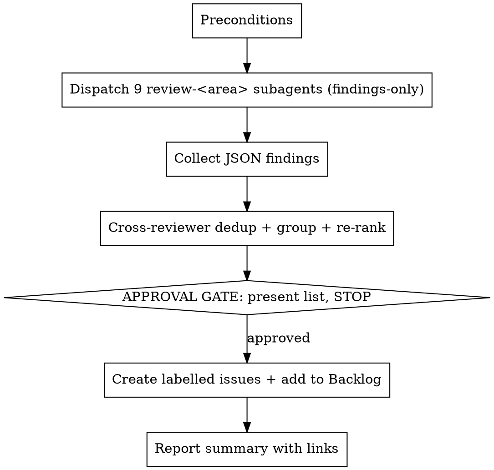

# Codebase Audit (orchestrator)

## Overview

Runs a full audit of the Staccato monorepo by dispatching the **nine `review-<area>` skills as parallel subagents in findings-only mode**, then deduplicating, grouping, and triaging their findings into one severity-ranked list. **Nothing is filed until the user approves.** On approval, each item becomes a labelled GitHub issue added to the Staccato Development board "Backlog" column.

**Core principle:** each reviewer is narrow and read-only; the orchestrator owns cross-reviewer synthesis, the single approval gate, and all filing.

For a focused single-area run, invoke the matching `review-<area>` skill directly instead — it does its own triage and filing. This skill is for the **one-off whole-codebase baseline**; a diff-scoped variant for PR pipelines is planned separately.

## When to Use

- A full, from-scratch audit of the existing codebase ("review everything as-is").
- Establishing a clean baseline before a large refactor or new app (e.g. mobile).

**Not for:** one focus area (use `review-<area>`); a single PR/branch diff (use `code-review` / `/ultrareview`); fixing a known bug (use `systematic-debugging`).

## Shared references

Read these first — they are the single source of truth shared with every reviewer skill:

- `.claude/audit/conventions.md` — conventions to load + monorepo map + overlap rule.
- `.claude/audit/rubric.md` — severity rubric + finding schema + reviewer id prefixes.
- `.claude/audit/create-issues.md` — `gh` recipe for issues + board (real IDs, `--owner staccatoapp`).

## Workflow



### 1. Preconditions

- Confirm you're in the `staccato` repo. The audit reads code **as committed**; note any uncommitted changes.
- The board step needs `gh` authed and `--owner staccatoapp` on every `gh project` call (see `create-issues.md`). Don't block the review on this — only step 5 needs it.

### 2. Dispatch nine reviewers in parallel (findings-only)

Spawn one `general-purpose` subagent per area **in a single message** (parallel). The nine areas: `security`, `structure`, `type-safety`, `performance`, `database`, `api-contract`, `observability`, `correctness`, `tests`.

**Scope each reviewer.** No reviewer reviews the whole tree. The per-area path manifest lives in the table in `conventions.md`. Restate the reviewer's in-scope/skip paths in its dispatch prompt so it can't drift, and remind it to work one app/package at a time.

Each subagent prompt MUST say, in substance:

> Use the `review-<area>` skill to review the Staccato codebase. **Your scope:** review only `<in-scope paths for this area, from conventions.md>`; skip `<skip paths>`. Work through them one app/package at a time. Operate in **findings-only mode**: produce your fenced `json` findings array per the schema and STOP — do **not** triage, do **not** file issues, do **not** edit any code. Ground every finding by quoting the actual code in `evidence` (drop anything you can't quote). Output your one-paragraph summary **first**, then the JSON array as the **last fenced ```json block**.

(The reviewer skills read the shared conventions/rubric themselves, so you don't need to paste those in — but do restate the scope, as above, so it survives even if a subagent skims the skill.)

### 3. Collect findings

Parse the **last fenced ```json block** from each reviewer (the one-paragraph summary precedes it). If a reviewer returns malformed JSON, an empty `[]`, or fails, note it — never silently drop a reviewer.

### 4. Dedup, group, re-rank

The reviewers overlap by design, so this step is load-bearing:

- **Merge** findings pointing at the same root cause/location across reviewers into one **merged finding** per the shape defined in `rubric.md` (`ids[]`, `areas[]`, highest `severity`/`confidence`, unioned `locations`, clearest `evidence`).
- **Group** the merged set by severity, then area, for presentation.
- Re-rank within severity by confidence and blast radius.

### 5. APPROVAL GATE (mandatory — never skip)

Present the consolidated, triaged list to the user as markdown grouped by severity. For each item show: title, severity, area(s), location(s), one-line description, recommendation. Then **STOP and ask the user to approve, edit, drop, or re-severity items.**

**Do NOT create any GitHub issue or touch the board before explicit approval.** Issue creation is outward-facing and has no bulk-undo. If the user is silent, ask. Offer a severity floor (e.g. file High/Critical individually, collapse Low into one tracking issue) so the board isn't flooded.

### 6. File approved items

Follow `.claude/audit/create-issues.md`: ensure labels, create one issue per approved item (labelled `audit` + `area:<area>`(s)), set its `Priority` issue field from the severity, and add each to the Backlog column. Check existing `audit`-labelled issues first to avoid duplicates on a re-run.

### 7. Report

Summarise: counts by severity, links to created issues, anything deferred, and any reviewer that failed to run.

## Common Mistakes

- **Skipping the approval gate** — the most damaging error; floods the board with un-reviewed issues.
- **Skipping dedup** — without it the same `any` in a route handler gets filed by several reviewers.
- **Forgetting `--owner staccatoapp`** on `gh project` calls — they silently target your empty personal projects.
- **Letting a subagent triage/file** — in this flow reviewers are findings-only; the orchestrator is the only writer.
- **Not scoping a reviewer** — dispatching "review the codebase" instead of its path manifest gives a single agent too much surface, which is where fabricated locations come from. Always restate the scope.
- **Filing un-grounded findings** — any merged item whose `evidence` doesn't quote real code should be dropped at the gate, not filed.
