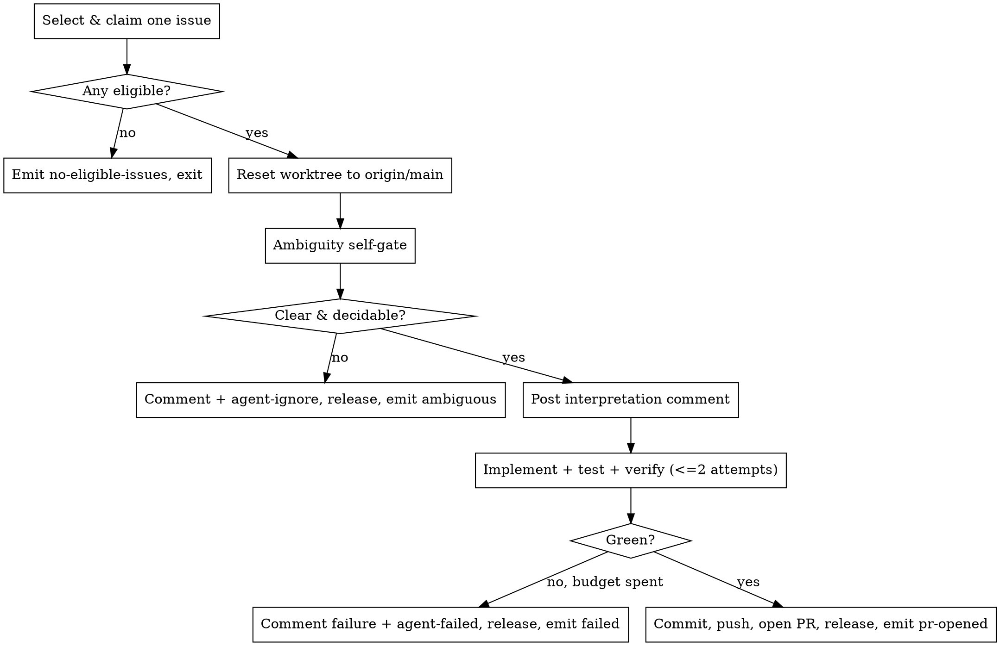

# Autonomous Issue to PR (unattended)

## Overview

Pick exactly **one** eligible GitHub issue, fix it end-to-end, and open a PR — with **no human interaction during the run**. This is the unattended sibling of `fix-issue`: it reuses that skill's mechanics and replaces its two human gates (requirements clarification, plan approval) with self-gates. Human oversight is the **PR review** — this skill never merges.

This skill is whitelisted in `CLAUDE.md` to run git commands.

**Core principle:** every terminal path either opens a PR or leaves the issue clearly labelled (`agent-ignore` or `agent-failed`) **with an explanatory comment**, always releases the `agent-in-progress` claim, and ends by emitting exactly one final line `FIA_STATUS=<status>` (the loop runner depends on it). An issue must never be left stuck in `agent-in-progress`.

`FIA_STATUS` values: `no-eligible-issues`, `pr-opened`, `ambiguous`, `failed`.

## When to Use

- Invoked by the `run-fix-issue-auto-loop.ps1` runner as `claude -p "/fix-issue-auto"`.
- **Not** for interactive work — a human wanting an issue done should use `fix-issue` (it has the clarify/plan gates).

## Prerequisites

- `gh` authenticated; labels `agent-in-progress`, `agent-failed`, `agent-ignore` exist.
- Run all `gh`/`git`/`pnpm` through the **Bash tool** (multi-line bodies and `\` continuations don't parse in PowerShell).
- Launched from the main repo (`C:\Projects\staccato`) with `--add-dir C:\Projects\staccato-fix-issue-agent` so the worktree is writable.

## Workflow



### Phase A — Select & claim one issue

1. List open issues with labels:
   ```bash
   gh issue list --state open --limit 200 \
     --json number,title,labels,url
   ```
2. Keep a candidate only if it has **at least one** `area:*` label AND has **none** of `agent-in-progress`, `agent-ignore`, `agent-failed`.
3. Drop candidates that already have an associated PR. For each candidate `<n>`:
   ```bash
   git -C /c/Projects/staccato ls-remote --heads origin "refs/heads/agent/<n>-*"
   gh pr list --state all --search "#<n> in:body" --json number,body
   ```
   If either returns a match referencing the issue, the issue is already being worked — skip it.
4. Pick the **lowest-numbered** survivor (deterministic; oldest first).
5. **Claim it immediately**, before any other work:
   ```bash
   gh issue edit <n> --add-label agent-in-progress
   ```
6. If there is no survivor, log "no eligible issues", emit `FIA_STATUS=no-eligible-issues`, and exit cleanly. Do nothing else.

Record `<n>` and a short kebab `<slug>` derived from the title for the branch name.

### Phase B — Reset the worktree to a clean origin/main

Unattended, there is no human to resolve a dirty worktree. Because this skill processes one issue per run and pushes every success, there is no unpushed work to lose — so reset unconditionally. **This is safe only because runs are sequential (the loop runner never runs two at once); do not run two instances concurrently.**

```bash
# Create the fixed worktree if absent (same path fix-issue uses)
if [ ! -d "/c/Projects/staccato-fix-issue-agent" ]; then
  git -C /c/Projects/staccato worktree add /c/Projects/staccato-fix-issue-agent main
fi

cd /c/Projects/staccato-fix-issue-agent
git fetch origin
# Detach so any leftover branch from a prior run can be reset/deleted
git checkout --detach origin/main
git reset --hard origin/main
git clean -fd
# Drop a stale local branch for this issue if one exists, then create fresh
git branch -D "agent/<n>-<slug>" 2>/dev/null || true
git checkout -b "agent/<n>-<slug>" origin/main
```

**PATH DISCIPLINE** (identical to `fix-issue`): every read/edit/write/command for the rest of the run uses `C:\Projects\staccato-fix-issue-agent` as root. Pass that path explicitly to any Explore agents.

### Phase C — Ambiguity self-gate (replaces fix-issue Phase 3 human gate)

Before writing any code, answer **in writing in your run output** each question. Be conservative — when unsure, treat it as ambiguous.

1. Is the expected behaviour specified (not just the symptom)?
2. Are the relevant edge cases clear?
3. Are the affected modules identifiable from the issue + repo?
4. Is there a single reasonable reading of what's being asked?
5. Is it self-contained — solvable from the repo without context only the maintainer holds?
6. **Design-decision check:** can this be resolved without a product/architecture decision you can't make alone (e.g. it could legitimately be split or designed multiple ways)?

There is intentionally **no scope/file-count gate** — a trivial refactor may touch many files; size is not the signal, undecidability is.

If **any** answer is "no": write the specific ambiguity to a UTF-8 file and bail.

```bash
# ambiguity.md written via the Write tool, absolute path, ASCII-safe
gh issue comment <n> --body-file /c/Projects/staccato-fix-issue-agent/ambiguity.md
gh issue edit <n> --remove-label agent-in-progress --add-label agent-ignore
```
Then emit `FIA_STATUS=ambiguous` and **stop the run**. Do not push anything.

### Phase D — Interpretation comment (replaces fix-issue Phase 4 human gate)

If the gate passed, post your interpretation and intended approach as a comment. This is an audit trail, **not** a blocking gate — do not wait for a reply.

```bash
# interpretation.md written via the Write tool, absolute path
gh issue comment <n> --body-file /c/Projects/staccato-fix-issue-agent/interpretation.md
```

### Phase E — Implement, test, verify (fix-issue Phases 5-7), budget = 2 attempts

Follow `fix-issue` **Phase 5 (Implement)**, **Phase 6 (Tests)**, and **Phase 7 (Verify)** exactly — including the Staccato logging/zod conventions and the `check-doc-updates` step. Run the full verify suite and show output:

```bash
pnpm lint:fix --force
pnpm check-types
pnpm test
pnpm build
```

If verification fails, you may make **one** more implement+verify cycle (2 attempts total). If it is still not green after the second attempt, bail:

```bash
# failure.md = a short summary + the failing command output, written via Write tool
gh issue comment <n> --body-file /c/Projects/staccato-fix-issue-agent/failure.md
gh issue edit <n> --remove-label agent-in-progress --add-label agent-failed
```
Then emit `FIA_STATUS=failed` and **stop**. Do **not** push a broken branch.

### Phase F — Commit, push, open the PR (fix-issue Phase 8)

Follow `fix-issue` **Phase 8** to commit (message referencing the issue + the mandated `Co-Authored-By:` trailer), push `agent/<n>-<slug>`, and open the PR with `gh pr create --base main --head agent/<n>-<slug>`, filling the repo template and including `Closes #<n>` (use `--body-file` with an absolute path). Then release the claim — the PR linkage supersedes it:

```bash
gh issue edit <n> --remove-label agent-in-progress
```

Log the PR URL, then emit `FIA_STATUS=pr-opened`.

## Guardrails

- **Never merge** the PR. Open it and stop.
- **One issue per run.** Never loop to a second issue — the runner handles repetition.
- **Always emit exactly one** `FIA_STATUS=<status>` line as the final output of the run.
- **Never remove** `agent-ignore` or `agent-failed` placed on prior runs, and never touch issues already carrying them.
- **Always release `agent-in-progress`** on every terminal path (success → removed; ambiguous → swapped for `agent-ignore`; failed → swapped for `agent-failed`). A stuck `agent-in-progress` issue is a bug.
- **Fail safe:** if anything unexpected happens that you cannot resolve without guessing, treat it like the failure path (comment + `agent-failed`, release claim, emit `FIA_STATUS=failed`) rather than pushing a speculative change.
- Never push to `main`; never commit secrets; never fabricate test results.

## Common Mistakes

- **Leaving `agent-in-progress` on** after an early return — the issue becomes invisible to future runs forever. Release it on every exit.
- **Forgetting the `FIA_STATUS` line** — the loop runner can't tell "done" from "more to do" without it.
- **Editing the main repo** instead of the worktree — all paths must be rooted at `C:\Projects\staccato-fix-issue-agent`.
- **Proceeding past an ambiguous issue** because "it's probably fine" — the self-gate is the only thing protecting PR quality; bail when unsure.
- **Pushing a red branch** — if verify isn't green after 2 attempts, it's `agent-failed`, not a PR.
- **Inlining non-ASCII issue/PR bodies** — write them to UTF-8 files and pass `--body-file` with an absolute path.
- **Skipping `--head` on `gh pr create`** in the worktree — pass it explicitly.
