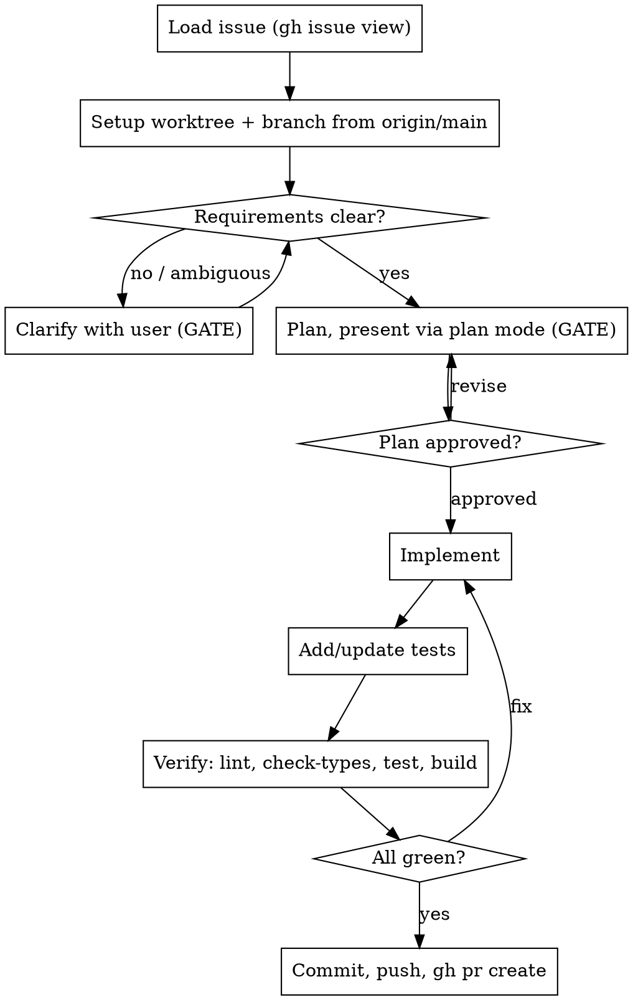

# Issue to PR

## Overview

Take one GitHub issue in the Staccato monorepo from specification to a verified pull request: load it, clarify, plan, implement, test, verify, and open the PR. Uses the **`gh` CLI** (the rest of this repo's GitHub tooling does — see `.claude/audit/create-issues.md`), run through the **Bash tool** so multi-line bodies parse correctly.

**Core principle:** two human gates — requirements and plan — come *before* any code, and nothing is claimed green without command output to back it.

This skill is whitelisted in `CLAUDE.md` to run git commands; outside it, the no-git-history rule still applies.

## When to Use

- The user gives an issue number/URL and wants it implemented end-to-end.
- "Turn issue #N into a PR", "implement/fix/address this issue".

**Not for:** a bug with no tracking issue (use `superpowers:systematic-debugging`); reviewing a branch/PR diff (use `code-review`); a known refactor with no issue (just do it under the normal workflow).

## Prerequisites

- `gh` authenticated; working directory is the `staccatoapp/staccato` repo (the remote infers owner/name — no `--owner` needed for `gh issue`/`gh pr`; `gh project` calls still need `--owner staccatoapp`).
- Run all `gh` and `git` commands through the **Bash tool**, not PowerShell — multi-line `--body`/commit bodies and `\` continuations don't parse in PS 5.1.

## Workflow



Follow the phases in order. Do not skip the two gates.

### Phase 1 — Load the issue

1. Get the issue number/URL from the user if not given.
2. `gh issue view <n> --comments` for title, body, labels, and discussion. Read linked issues/PRs if referenced.
3. Summarise the issue back to the user.

### Phase 2 — Setup the worktree

Run the worktree setup **immediately after loading the issue** — before clarifying requirements or planning. This ensures all file reads during Phases 3 and 4 come from the fixed worktree on `origin/main`, not from whatever branch the main repo is currently on.

Use the fixed worktree at `C:\Projects\staccato-fix-issue-agent` — a sibling of the main repo, so main-repo agents never traverse it. This path is reused across issues; each issue gets its own branch inside it.

**Setup (run via Bash tool):**

```bash
# 1. Create the fixed worktree if it doesn't exist
if [ ! -d "/c/Projects/staccato-fix-issue-agent" ]; then
  git -C /c/Projects/staccato worktree add /c/Projects/staccato-fix-issue-agent main
fi

# 2. Check for uncommitted work from a previous issue
cd /c/Projects/staccato-fix-issue-agent
git status --short
```

If `git status` shows any changes, **stop and show the user the output**. Ask them to resolve it (commit, stash, or discard) before continuing. Do not proceed to step 3 until the worktree is clean.

```bash
# 3. Create the issue branch directly from origin/main.
# Do NOT `git checkout main` first — git worktree prevents checking out a branch
# that is already checked out in another worktree (the primary repo holds main).
git fetch origin
git checkout -b agent/<issue#>-<short-slug> origin/main
```

**PATH DISCIPLINE** — every subsequent operation must use `C:\Projects\staccato-fix-issue-agent` as the root, not `C:\Projects\staccato`:
- **Bash**: run `pnpm`, `git`, and `gh` from inside the worktree; never `cd` back to the main repo.
- **Explore agents**: pass `C:\Projects\staccato-fix-issue-agent` as the search root explicitly in the agent prompt.
- **Read / Edit / Write**: use absolute paths rooted at `C:\Projects\staccato-fix-issue-agent`.

Violating this causes edits to land in the main repo's working tree.

### Phase 3 — Clarify requirements (GATE)

**REQUIRED SUB-SKILL:** when the issue is open-ended (a feature, a vague report, multiple interpretations), use `superpowers:brainstorming` to surface intent before planning.

Stop and ask the user if **any** of these hold: expected behaviour under-specified, edge cases unaddressed, affected modules unclear, multiple readings possible, or it leans on context not in the repo. If it's genuinely clear and self-contained, say so and proceed.

### Phase 4 — Plan (GATE)

**REQUIRED SUB-SKILL:** use `superpowers:writing-plans` to produce the plan after researching the relevant code, patterns, and existing tests.

Cover: files created/modified, the change per file, tests to add/update, and how it'll be verified. **Present the plan through plan mode (`ExitPlanMode`)** so approval is an explicit gate — no code changes until approved. Revise and re-present on feedback.

> **Note:** `writing-plans` defaults to saving plans under `docs/superpowers/plans/`. When plan mode is active, the plan mode system message specifies its own file path — use that path instead.

### Phase 5 — Implement

The worktree and branch are already set up (Phase 2). All work happens in `C:\Projects\staccato-fix-issue-agent`.

1. Make surgical changes that follow existing patterns; no unrelated churn.
3. Honour Staccato conventions (`CLAUDE.md`):
   - Cross-app-boundary types use **zod** in `packages/shared/src/types/zod`, with validation at use sites; prefer the shared package for non-project-specific helpers.
   - **Logging:** every `catch` logs; every external call site (MusicBrainz/AcoustID/Lidarr/Cover Art) logs failures with context. Object-first: `log.warn({ err, operation, ...ids }, "message")` — never string interpolation. Pick the level per the log-level guidance in `CLAUDE.md`.

### Phase 6 — Tests

**REQUIRED SUB-SKILL:** use `superpowers:test-driven-development` for new or changed logic.

Add unit tests (and integration tests where the change crosses a boundary) covering the edge cases identified in Phase 3. Match the repo's existing test layout and framework (Vitest, run via `pnpm test`).

### Phase 7 — Verify

**REQUIRED BACKGROUND:** `superpowers:verification-before-completion` — show command output; never claim green from assumption.

Run and confirm each passes, fixing and re-running on failure:

```bash
pnpm lint:fix --force  # --force bypasses turbo cache so lint runs on every package, not just ones turbo considers dirty
pnpm check-types       # tsc across the monorepo
pnpm test              # vitest
pnpm build         # production build
```

If something genuinely can't be verified here (missing service/dep), state exactly what and why — don't fabricate results.

### Phase 8 — Commit and open the PR

1. Commit with a message referencing the issue (e.g. `fix: resolve queue race (#42)`), ending with the `Co-Authored-By:` trailer the harness mandates. Prefer focused commits when the change decomposes naturally.
2. `git push -u origin agent/<issue#>-<short-slug>`.
3. Open the PR with `gh pr create --base main`. Fill the repo template at `.github/PULL_REQUEST_TEMPLATE/pull-request-template.md` ("What's being changed and why?" + "Verification steps") and include `Closes #<n>`. Write the body to a UTF-8 file and pass `--body-file` (inline non-ASCII gets mangled at the shell boundary) — end it with the `🤖 Generated with [Claude Code]` line.
4. Optional: add the issue to the Staccato Development board / move its card using the `gh project ... --owner staccatoapp` recipe in `.claude/audit/create-issues.md`.
5. Give the user the PR URL.

## Guardrails

- Never skip the Phase 3 and Phase 4 gates — even if the issue "looks obvious."
- Never push to `main`; always the `agent/<issue#>-…` branch. Never open the PR before verification passes.
- Never commit secrets/tokens. Never fabricate test results. Never merge the PR — leave that to review/CI.
- If the issue is large, propose splitting it into smaller PRs and confirm scope before implementing.
- Uncertain at any point? Stop and ask rather than guess.

## Common Mistakes

- **Skipping the worktree setup** — Phase 2 always sets up `C:\Projects\staccato-fix-issue-agent` via the Bash snippet. Don't skip the dirty-check; if the worktree is dirty, stop and ask the user to resolve it before proceeding.
- **`git checkout main` in the worktree** — git prevents checking out a branch that is already checked out in another worktree. The primary repo holds `main`, so running `git checkout main` inside the fix-issue worktree always fails. Always create the issue branch directly from `origin/main` with `git checkout -b agent/... origin/main`.
- **Summarising the issue and diving straight to code** — skips worktree setup and both gates; the most common failure. Set up the worktree, confirm requirements, then get plan approval.
- **Running `gh`/`git` through PowerShell** — multi-line bodies and `\` continuations break. Use the Bash tool.
- **Inlining the PR body** — em-dashes/curly quotes mangle on the command line. Use `--body-file` with a UTF-8 file. Pass an **absolute path** to `--body-file`; `gh` does not resolve relative paths from the repo root when invoked via Bash.
- **Claiming "tests pass" without output** — run `pnpm test`/`lint`/`check-types`/`build` and show it.
- **Re-deriving planning/TDD/clarify logic inline** — defer to the referenced sub-skills instead of duplicating them.
- **Generic branch names** (`fix/...`, `patch-1`) — this repo uses `agent/<issue#>-<slug>`.
- **Skipping a `catch`/external-call log** — fails review under the Staccato logging rules; add it during Phase 5, not after.
- **Editing main-repo files from inside the worktree** — if Read/Edit/Write paths or Bash commands point at `C:\Projects\staccato\` instead of `C:\Projects\staccato-fix-issue-agent\`, changes land in the main checkout. Always use the fixed sibling path.
- **Passing the wrong root to Explore agents** — explorers default to the session cwd. Explicitly pass `C:\Projects\staccato-fix-issue-agent` as the search root or they may search the main repo and return paths that don't translate.
- **`gh pr create` missing `--head` in a worktree** — when `gh` is run from inside the worktree via Bash, the shell cwd may be reset between commands, causing `gh` to lose track of the current branch. Always pass `--head agent/<issue#>-<slug>` explicitly to `gh pr create`.
