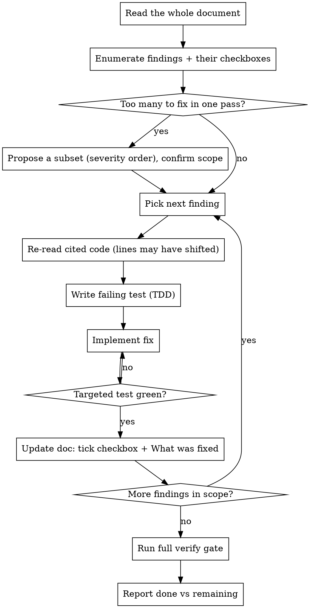

# Fix Review Findings

## Overview

Take a code-review findings document and turn its findings into verified fixes in the working tree, updating the document as you go so it stays an accurate record of what's done and what remains.

**Core principle:** every fix is test-driven and the document is the single source of truth for progress — tick a finding's checkbox and write its "What was fixed" note only _after_ the fix is implemented and its test passes, never before.

This skill does **not** touch git history. The repo-wide no-commit rule in `CLAUDE.md` applies — fix in the working tree, run the verify gate, and leave committing to the user.

## When to Use

- The user gives a path/filename to a review findings doc and wants the findings fixed.
- "Work through `docs/review/staccato-connect-1406.md`", "fix the findings", "address the review".

**Not for:** reviewing an existing diff (use `code-review`); a GitHub issue end-to-end (use `fix-issue`); an ad-hoc bug with no findings doc (use `superpowers:systematic-debugging`).

## Inputs

The user passes the document filename or path. If only a bare filename is given, look under `docs/review/`. If you can't locate it, ask — don't guess.

## Workflow



### Phase 1 — Read and enumerate

1. Read the **entire** document. Note its structure: each finding has a stable id (e.g. `SC-1`), a severity, a file location, root cause, and fix guidance. There is usually a verification **checklist of checkboxes** (often at the end) — map each checkbox back to its finding id.
2. List the findings with id, severity, and one-line summary, and note which are already ticked (skip those).

### Phase 2 — Scope (handle large documents)

A finding can be a substantial fix. Don't blindly attempt everything.

- If there are only a few open findings (roughly ≤4) and they're contained, do them all.
- Otherwise, **propose a subset and confirm scope with the user before fixing.** Order by severity (the doc usually marks HIGH/MED/LOW, and may flag "gating" findings that must land first — respect that order). State which ids you'll take this pass and which you'll leave. Provide a default recommendation rather than always prompting when findings are small and contained.
- If a finding depends on another (the doc's "Related" notes), keep dependents together or do the prerequisite first.

### Phase 3 — Fix each finding (TDD)

**REQUIRED SUB-SKILL:** use `superpowers:test-driven-development` — write the failing test first, watch it fail, then implement.

For each finding in scope:

1. **Re-read the cited code.** Line numbers were captured at review time and earlier fixes shift later lines — locate by symbol/content, not the stale line number.
2. Write the test the finding describes (most findings end with an explicit "add a test that…"). Confirm it fails for the stated reason.
3. Implement the fix following the finding's guidance and Staccato conventions (`CLAUDE.md`): zod for cross-boundary types with validation, object-first logging on every `catch` and external-call failure, correct log level.
4. Run the **targeted** test (the specific file/suite) and confirm green before moving on. Save the full gate for the end.

### Phase 4 — Update the document (per finding, right after it's green)

Two edits per fixed finding:

1. **Tick its checkbox** in the verification checklist: `- [ ]` → `- [x]`.
2. **Add a "What was fixed" note** to the finding's own section, 2–3 sentences: what changed, where, and the test that now guards it. Place it after the fix guidance.

```markdown
**What was fixed.** Gave each `DeviceConnection` a monotonic `connId` and made
`unregister` delete only when the stored connection's id matches the closing one.
Added a registry test (register A, register B for the same device, unregister A →
B stays online) which now passes.
```

Update the document immediately after each fix, not in a batch at the end — if the run is interrupted, the doc still reflects reality.

### Phase 5 — Verify

Run the full gate from `CLAUDE.md` once, after the in-scope fixes are done, and show the output (`superpowers:verification-before-completion`):

```bash
pnpm lint:fix --force
pnpm check-types
pnpm test
pnpm build
```

Fix and re-run on failure. Then invoke `check-doc-updates` to see whether any changed subsystem's rules or internal docs need updating (the review doc's own checklist often calls specific rule files out).

### Phase 6 — Report

Tell the user: which finding ids were fixed (with their checkboxes now ticked), which remain and why, and the verify-gate result. If you did a subset, make the remaining scope explicit so a follow-up run can pick up where this left off.

## Guardrails

- **Never tick a checkbox or write "What was fixed" before the fix is implemented and its test passes.** The document must never claim more than is true.
- Never commit or push — the no-git-history rule applies (this skill is not whitelisted).
- Never fabricate verify output; if something can't be run, say exactly what and why.
- Don't skip a finding's test because the fix "looks obvious" — the doc asks for the test for a reason.
- If a finding's guidance seems wrong or unsafe on a fresh read of the code, stop and raise it with the user rather than implementing it blindly.

## Common Mistakes

- **Trusting the stale line numbers** — the doc warns they shift; locate code by content.
- **Batching all the doc edits to the end** — update per finding so progress survives interruption.
- **Running the full `pnpm build`/`test` gate after every single finding** — use targeted tests per fix, full gate once at the end.
- **Fixing everything in a huge doc without confirming scope** — propose a severity-ordered subset first.
- **Writing a "What was fixed" note that just restates the finding** — describe the actual change and the guarding test, in 2–3 sentences.
- **Skipping `check-doc-updates`** — behavioural fixes often need a rule/internal-doc update; the review checklist usually names which.
